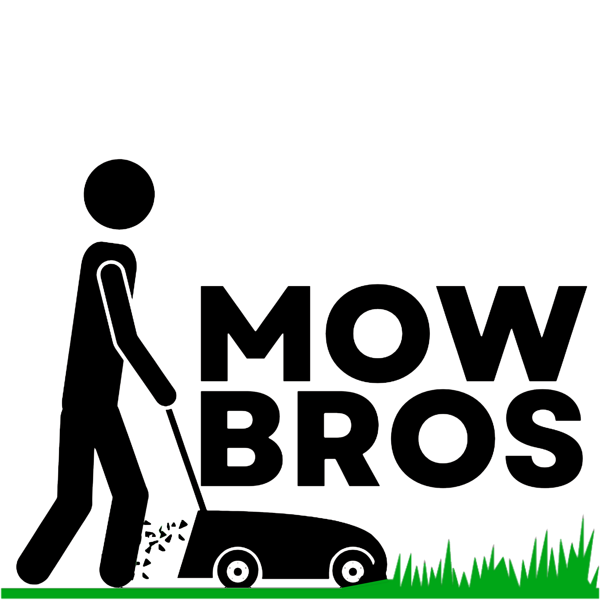

# Assets Guide - Adding Images to Your Website

## 📁 Folder Structure

```
Mow-Bros-Website/
├── assets/
│   ├── images/
│   │   ├── logo.png              ← Your Mow Bros logo
│   │   ├── hero-lawn.jpg         ← Main lawn/grass image
│   │   ├── drone-shot.jpg        ← Drone aerial photo
│   │   ├── footer-logo-1.png     ← Footer social icon
│   │   └── footer-logo-2.png     ← Footer social icon
│   └── gallery/
│       ├── project-1.jpg         ← Before/after gallery images
│       ├── project-2.jpg
│       ├── project-3.jpg
│       └── ...
├── index.html
├── styles.css
├── script.js
└── README.md
```

## 🖼️ Images to Add

### Required Images (Core Website)

| File | Filename | Dimensions | Notes |
|------|----------|------------|-------|
| **Logo** | `assets/images/logo.png` | 200x200px | Company logo (from Wix site) |
| **Hero Image** | `assets/images/hero-lawn.jpg` | 1920x1080px | Background for hero section |
| **Lawn/Grass** | `assets/images/drone-shot.jpg` | 1200x800px | Drone aerial photo for quote section |
| **Footer Icon 1** | `assets/images/footer-logo-1.png` | 150x150px | Company branding |
| **Footer Icon 2** | `assets/images/footer-logo-2.png` | 150x150px | Company branding |

### Optional Images (Gallery)

- Add 3-6 project photos in `assets/gallery/`
- Recommended size: 800x600px
- Formats: JPG or PNG
- Examples: Before/after lawn shots, completed projects

## 📥 How to Add Your Images

### Step 1: Get the Images from Your Wix Site
The following images are on your current Wix site:
- Mow Bros Logo Left to Right.png
- pexels-pixabay-280222.jpg (lawn background)
- DJI_0197.JPG (drone photo)
- 2.png (footer logo)
- 3.png (footer logo)

### Step 2: Download or Copy Images
1. Visit your Wix site: https://mowbrosmn.wixsite.com/mow-bros
2. Right-click on each image → "Save image as..."
3. Save to your Downloads folder

### Step 3: Move to Correct Folder
```bash
# Navigate to your project folder
cd /Users/benjaminjbsmith/Desktop/Mow-Bros-Website

# Move files to assets/images/
mv ~/Downloads/"Mow Bros Logo Left to Right.png" assets/images/logo.png
mv ~/Downloads/pexels-pixabay-280222.jpg assets/images/hero-lawn.jpg
mv ~/Downloads/DJI_0197.JPG assets/images/drone-shot.jpg
mv ~/Downloads/2.png assets/images/footer-logo-1.png
mv ~/Downloads/3.png assets/images/footer-logo-2.png

# For gallery images
mv ~/Downloads/project*.jpg assets/gallery/
```

### Step 4: Upload to GitHub
```bash
cd /Users/benjaminjbsmith/Desktop/Mow-Bros-Website
git add assets/
git commit -m "Add website images and logos"
git push
```

## 🔗 Image References in HTML

The website code already references these images:

```html
<!-- Logo in header -->


<!-- Hero section background (CSS) -->
background: url('assets/images/hero-lawn.jpg');

<!-- Drone photo -->

```

## 🎨 Image Optimization Tips

- **Logo**: Should be PNG with transparent background
- **Hero Image**: Full width background, 1920x1080px minimum
- **Gallery**: Keep consistent aspect ratio (16:9 or 4:3)
- **File Size**: Compress images for faster loading
  - Use tools like TinyPNG.com or ImageOptim.app

## 🖼️ Adding Gallery Images

If you want to add a photo gallery:

1. Add images to `assets/gallery/` folder
2. Update HTML with gallery section:
```html
<section class="gallery">
  <h2>Our Work</h2>
  <div class="gallery-grid">
    
    
    
  </div>
</section>
```

3. Add CSS styling in `styles.css`

## ✅ Checklist

- [ ] Created `assets/images/` folder
- [ ] Created `assets/gallery/` folder
- [ ] Downloaded logo from Wix site
- [ ] Downloaded hero image
- [ ] Downloaded drone photo
- [ ] Moved all images to correct folders
- [ ] Renamed files to match references (logo.png, hero-lawn.jpg, etc.)
- [ ] Tested website locally (images should display)
- [ ] Pushed images to GitHub
- [ ] Website deployed and images showing live

## 🚀 Next Steps

1. Add images to your local project
2. Test by opening `index.html` in browser
3. Push to GitHub: `git push`
4. Check live site for images

## 💡 Troubleshooting

**Images not showing?**
- Check file path in HTML matches actual folder location
- Make sure file extensions match (jpg vs jpeg, png, etc.)
- Clear browser cache (Cmd+Shift+R on Mac)
- Check browser console for errors (F12)

**File names have spaces?**
- Rename to use hyphens instead: `my image.jpg` → `my-image.jpg`
- Or use underscores: `my image.jpg` → `my_image.jpg`

**Image file too large?**
- Compress using online tools or image software
- Target: Under 500KB per image
- Use WebP format for better compression

## 📞 Support

If you need help:
1. Check that files are in the right folders
2. Verify file names match HTML references
3. Test on different browsers
4. Contact: mowbrosmn@gmail.com
